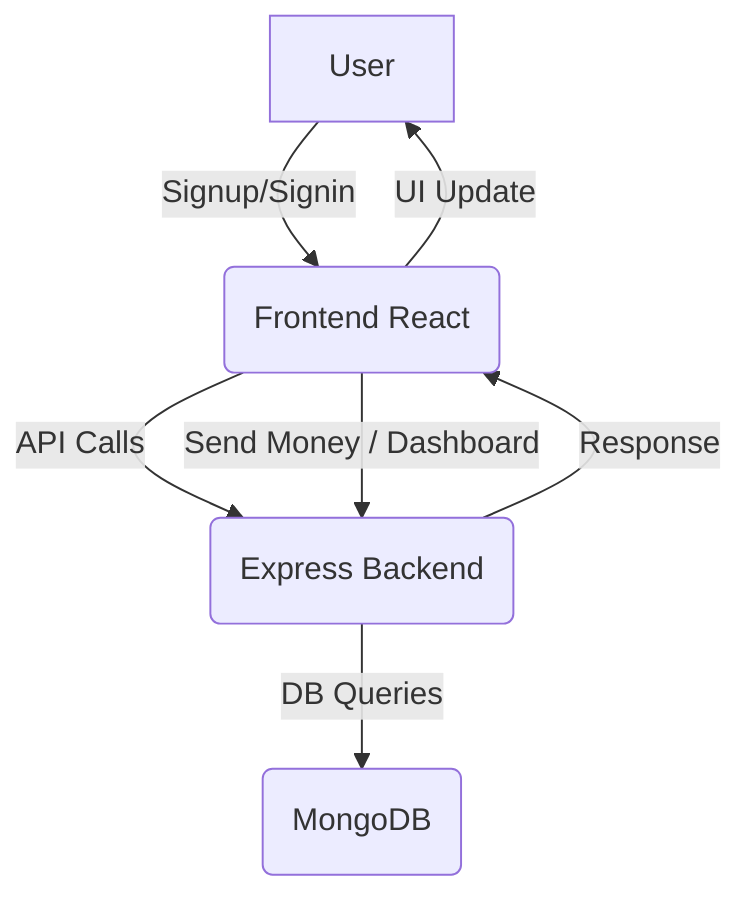

# Swift-Pay – React + Vite + Express + MongoDB

This project is a Paytm-like application with a React frontend (using Vite) and an Express backend, connected to MongoDB.

## Project Structure

```
Paytm/
├── backend/    # Express backend (API, MongoDB models)
├── fontend/    # React frontend (Vite, TailwindCSS)
├── Mongodb/    # MongoDB Docker setup
```

## Installation & Running

### 1. Clone the repository

```sh
git clone <repo-url>
cd Paytm
```

## Project Structure

```
Paytm/
├── backend/    # Express backend (API, MongoDB models)
├── fontend/    # React frontend (Vite, TailwindCSS)
├── Mongodb/    # MongoDB Docker setup
```

## Installation & Running

### 1. Clone the repository

```sh
git clone <repo-url>
cd Paytm
```

### 2. Install backend dependencies

```sh
cd backend
npm install
```

### 3. Install frontend dependencies

```sh
cd ../fontend
npm install
```

#### Or, ensure MongoDB is running locally on port 27017.

- Frontend runs on [http://localhost:5173](http://localhost:5173)
- Backend runs on [http://localhost:3000](http://localhost:3000)

---

### 4. Start MongoDB

- You can use the provided Dockerfile in `Mongodb/` or run MongoDB locally.

#### Using Docker:

```sh
cd ../Mongodb
docker build -t paytm-mongo .
docker run -d -p 27017:27017 paytm-mongo
```

#### Or, ensure MongoDB is running locally on port 27017.

### 5. Start backend server

```sh
cd ../backend
node index.js
```

### 6. Start frontend server

```sh
cd ../fontend
npm run dev
```

- Frontend runs on [http://localhost:5173](http://localhost:5173)
- Backend runs on [http://localhost:3000](http://localhost:3000)

---

## Project Flow Diagram



---

## Features

- User Signup/Signin
- Dashboard with user search
- Send money between users
- MongoDB for data persistence

---

## Tech Stack

- **Frontend:** React, Vite, TailwindCSS
